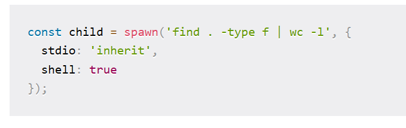
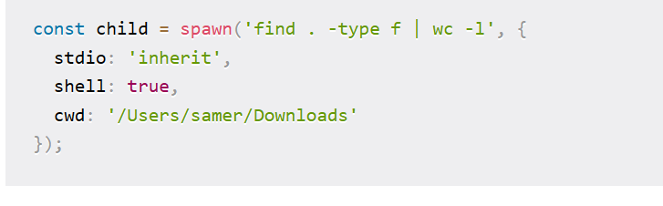

# child process
当一个耗时操作不是异步(有的时候异步也解决不了)的, 可以选择将其转移到 child_process 中
## event handler
1. disconnect 所有子进程失联
2. error error or killed
3. close 单个子进程关闭(stdio close)
4. message 子进程使用`process.send()`来进行父子进程之间的通信`

## io 流类型
`stdin stdout stderr` event emitter so add a event listener
同时可以使用`pip`来传递 stream

## 使用`shell`方式来运行同时将输出定位到主线程输出中

1. 设置线程运行方式
2. 设置`stdio: 'ignore', detached: true child.unref();`可以将子线程完全独立出去 

## 使用`fork`控制父子进程之间的通信
fork.send() fork.on('message', () => {})